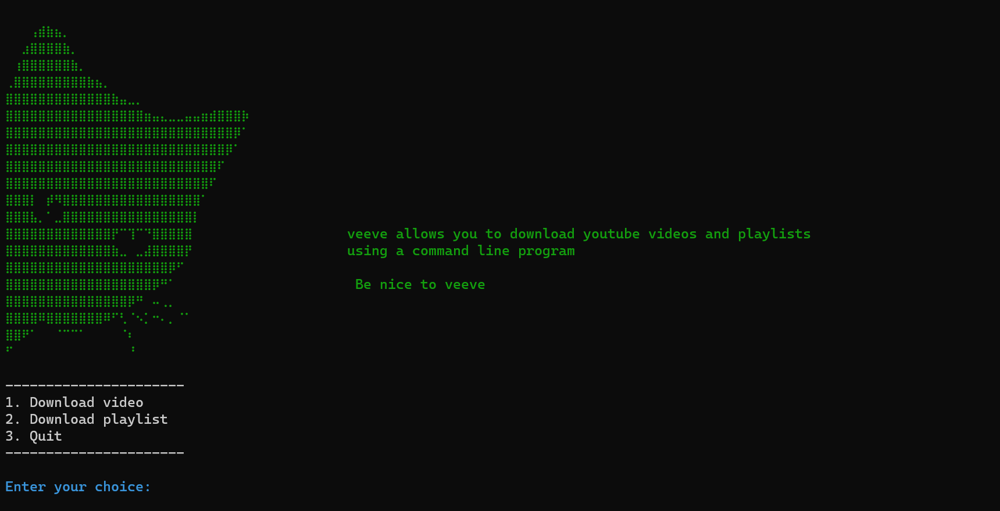
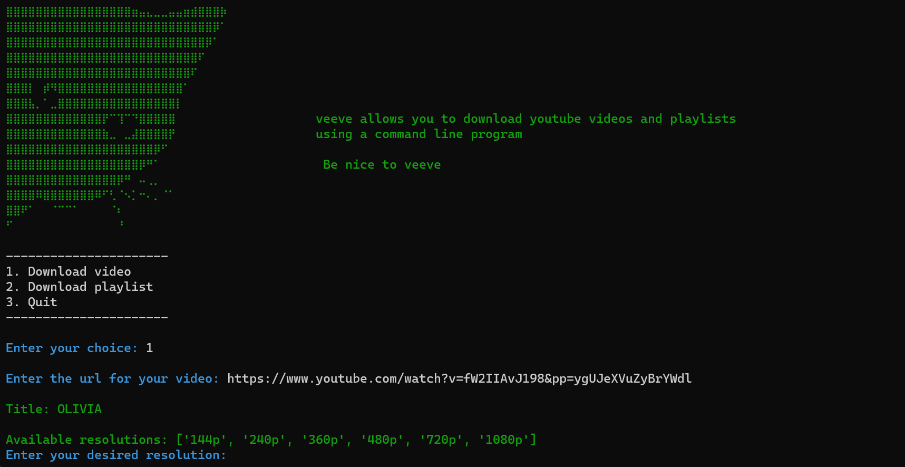

# veeve


  ## About veeve
 **veeve** is a console program that allows the user to do perform the following actions
 
 * download youtube videos 
 * download youtube playlists
  
  **Note:** The program only allows the user to download videos off of youtube 
 
 **veeve** displays the available resolutions for the video and allows the user to download the video at their desired resolution. 


---
## Clips




---


## Libraries
- pytube
  
  ```pip install pytube```
- colorama
  
  ```pip install colorama```

The pytube library allows one to download videos off of youtube.

The colorama library allows one to use colors in the terminal.

---

## New Features
 - **Download Audio Files**

   The user is be able to convert downloaded videos into audio files (mp3).

    **Note:** You must have `ffmpeg` set up on your device for this feature to work.


