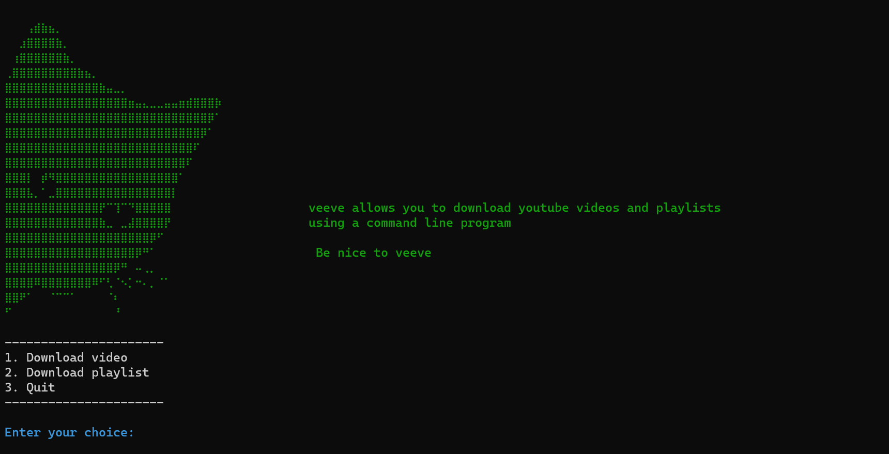
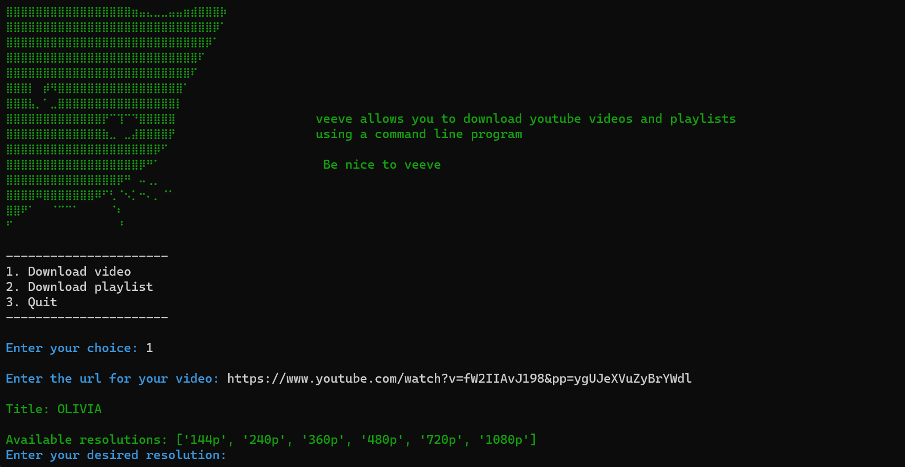

# veeve


  ## About veeve
 **veeve** is a console program that allows the user to do perform the following actions
 
 * download youtube videos 
 * download youtube playlists
  
  **Note:** The prgogram only allows the user to download videos off of youtube 
 
 **veeve** displays the available resolutions for the video and allows the user to download the video at their desired resoltion 

---
## Clips




---


## Libraries
- pytube
  
  ```pip install pytube```
- colorama
  
  ```pip install colorama```

The pytube library allows one to download videos off of youtube

The colorama library allows one to use colors in the terminal

---

## Upcoming Features
 - **Download Audio Files**

   The user will be able to download music in the mp3 format

    **Note:** The pytube library doesn't allow one to download files in the mp3 format


